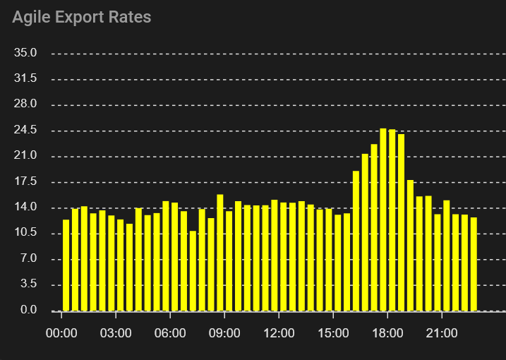
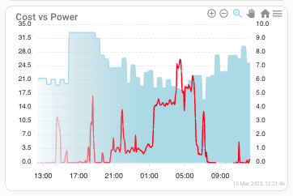

# Community Contributions

- [Community Contributions](#community-contributions)
  - [Agile Price Table](#agile-price-table)
  - [Export Rates Chart](#export-rates-chart)

These are a few contributions by the community.

## Agile Price Table

If you're wanting to display upcoming prices in a nice readable format, then might I suggest you utilise the plugin developed by @lozzd available at https://github.com/lozzd/octopus-energy-rates-card.

## Export Rates Chart

Thanks to @fboundy you can use ApexCharts to plot the rates for the current day. After you have installed ApexCharts, you can use the following configuration

```yaml
type: custom:apexcharts-card
  header:
    show: true
    show_states: true
    colorize_states: true
    title: Agile Export Rates
  graph_span: 1d
  stacked: false
  span:
    start: day
  yaxis:
    - min: 0
      max: 35
      decimals: 1
  series:
    - entity: >-
        sensor.octopus_energy_electricity_{{METER_SERIAL_NUMBER}}_{{MPAN_NUMBER}}_current_rate
      type: column
      name: ''
      color: yellow
      opacity: 1
      stroke_width: 0
      unit: W
      show:
        in_header: false
        legend_value: false
      data_generator: |
        return entity.attributes.rates.map((entry) => {
           return [new Date(entry.from), entry.rate];
         });
      offset: '-15min'
```

which will produce something like the following...



If you're looking for cost vs power using ApexCharts, then @plandregan has you covered

```yaml
type: custom:apexcharts-card
experimental:
color_threshold: true
header:
show: true
floating: true
title: Cost vs Power
graph_span: 24h
show:
last_updated: true
loading: true
apex_config:
legend:
show: false
chart:
zoom:
type: x
enabled: true
autoScaleYaxis: false
toolbar:
show: true
autoSelected: zoom
xaxis.type: datetime
fill:
type: gradient
gradient:
shadeIntensity: 0.1
opacityFrom: 0.3
opacityTo: 1
inverseColors: true
series:

    entity: sensor.octopus_energy_electricity_***************************_current_rate
    transform: return x * 100;
    type: area
    name: GBP/kWh
    yaxis_id: pence
    color: lightblue
    group_by:
    func: avg
    duration: 5m
    stroke_width: 2
    extend_to: now
    show:
    extremas: false
    header_color_threshold: true
    entity: sensor.givtcp_grid_power
    transform: return x /1000;
    type: line
    invert: true
    name: Power
    yaxis_id: kwh
    group_by:
    func: avg
    duration: 5m
    color: red
    stroke_width: 2
    extend_to: now
    yaxis:
    id: pence
    min: 0
    max: 35
    opposite: false
    id: kwh
    min: 0
    max: 10
    opposite: true
```

which will produce something like the following...

